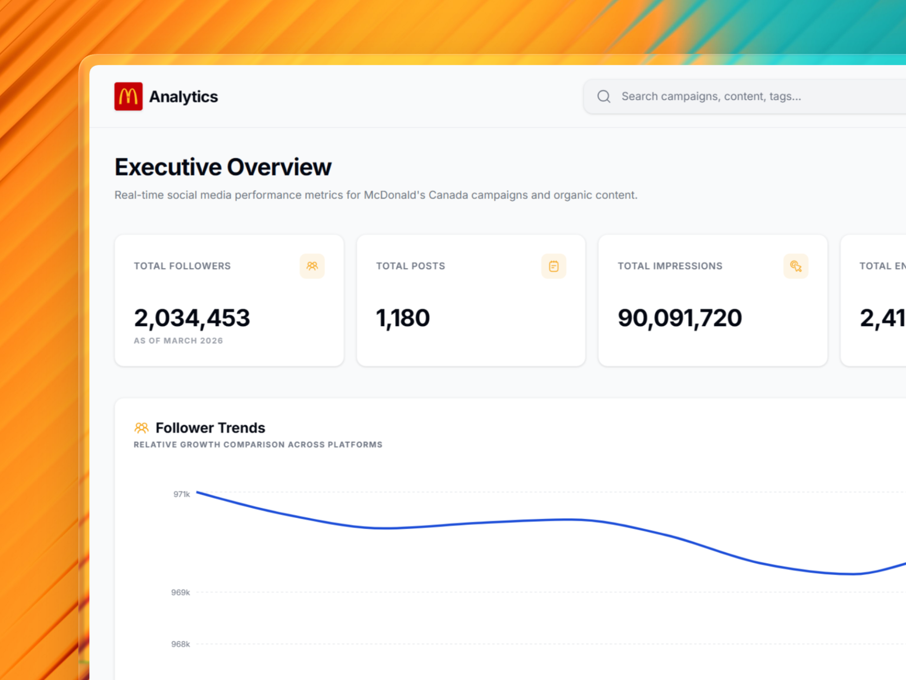
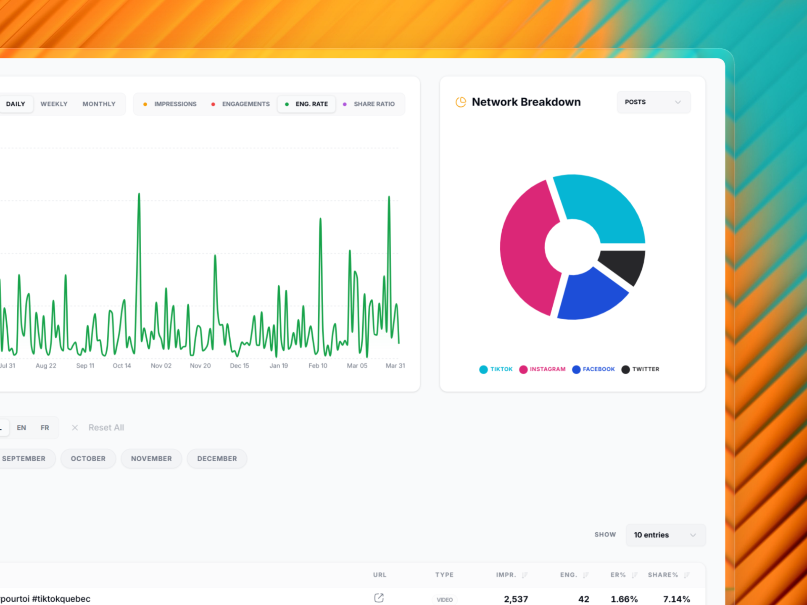
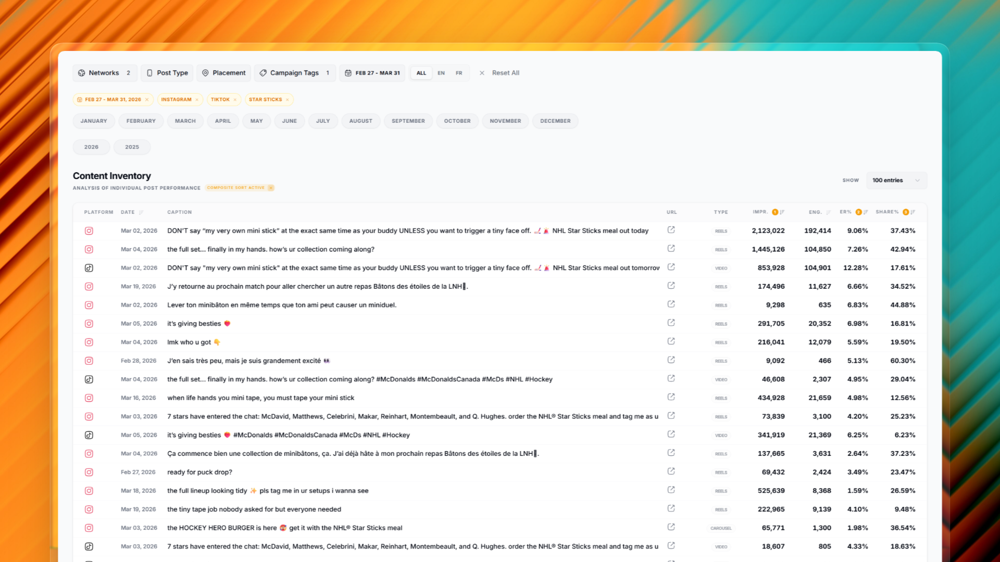
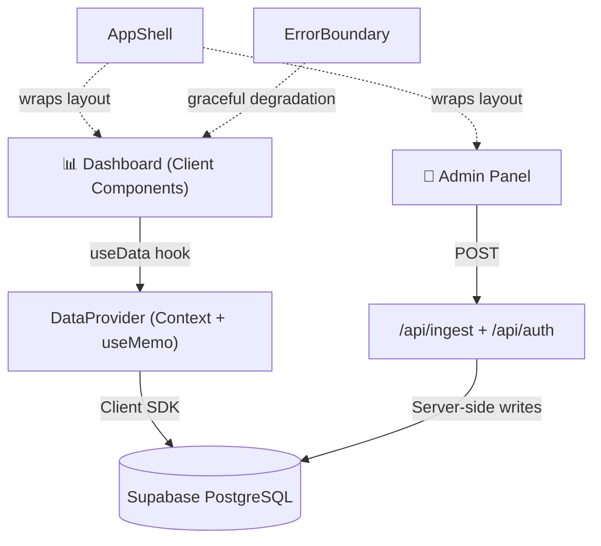

<h1 align="center">🍟 McDonald's Organic Insights</h1>

<p align="center">
  <strong>An interactive analytics dashboard that visualizes organic social media performance for McDonald's Canada — across TikTok, Instagram, Facebook, and X.</strong>
</p>

<p align="center">
  
  
  
  
  
  
  
</p>

<p align="center">
  <a href="https://mcd2025.vercel.app/"><strong>🔗 Live Dashboard</strong></a>
</p>

---

## About

McDonald's Organic Insights is a single-page analytics dashboard built for the **Cossette × McDonald's** marketing team by the **IA team**. It consolidates organic social data from four major platforms — **TikTok, Instagram, Facebook, and X** — into a single, filterable view packed with KPIs, trend visualizations, platform breakdowns, and a deep-dive content table.

Originally powered by local CSV uploads, the dashboard has since evolved into a full-stack application backed by **Supabase**, complete with a password-protected admin panel for drag-and-drop data ingestion and advanced multi-metric sorting — all deployed on **Vercel**.

---

## Screenshots

<p align="center">
  
  <br />
  <em>KPI stat cards, follower trends, and performance metrics at a glance</em>
</p>

<p align="center">
  
  <br />
  <em>Dynamic filtering with platform breakdowns and interactive area charts</em>
</p>

<p align="center">
  
  <br />
  <em>Searchable, sortable content table with multi-metric sorting</em>
</p>

---

## Features

### 📊 Dashboard Analytics

- **Stat Cards** — At-a-glance KPIs for total followers, posts, impressions, engagements, and engagement rate.
- **Follower Trends** — Line chart tracking monthly follower growth by platform, with an EN/FR language toggle.
- **Performance Chart** — Flexible area chart for any metric over time, with daily, weekly, and monthly granularity.
- **Network Breakdown** — Donut chart comparing metrics across all four platforms side by side.

### 🗄️ Enterprise Supabase Backend&ensp;`NEW`

- **Cloud-first data layer** — Migrated from local CSV files to a Supabase PostgreSQL backend, removing file-size limits entirely.
- **Batch fetching** — Efficient data retrieval that handles thousands of records seamlessly, keeping the dashboard snappy as data grows month over month.

### 🔐 Admin Suite&ensp;`NEW`

- **Drag-and-drop CSV ingestion** — Upload updated social data via a clean drag-and-drop interface on the `/admin` page.
- **Password-protected access** — Admin routes are secured behind authentication to prevent unauthorized data modifications.
- **Wipe Database** — One-click database reset for clean 1:1 CSV syncing when monthly data refreshes come in.

### 🔍 Filtering & Content Table

- **Advanced Filters** — Filter by network, post type, placement, tags, date range, or free-text search — all applied in real time.
- **Content Table** — Sortable, paginated table displaying every post with full engagement metrics and boosted-post highlighting.
- **Multi-Metric Sorting**&ensp;`NEW` — `Shift + Click` column headers to sort by multiple metrics simultaneously using Percentile Rank normalization, with a quick-reset button to clear all sorts.

---

## Tech Stack

| Category       | Technology                     |
| -------------- | ------------------------------ |
| Framework      | Next.js 16 (App Router)        |
| UI             | React 19, Tailwind CSS 4, shadcn/ui |
| Language       | TypeScript 5                   |
| Backend / DB   | Supabase (PostgreSQL)          |
| Charts         | Recharts                       |
| Icons          | HugeIcons                      |
| CSV Parsing    | PapaParse                      |
| Date Handling  | Day.js                         |
| Deployment     | Vercel                         |

---

## Architecture



The app is built around a few key architectural decisions:

### Centralized Data Layer

The **`DataProvider`** (`src/lib/data-context.tsx`) is the app's brain. It loads the master dataset from Supabase once on mount, then uses `useMemo` to automatically derive `filteredPosts` and aggregate `stats` whenever a filter changes. Every chart and table stays in sync — zero redundant network calls.

### Client-Heavy Rendering

Even though the project uses the Next.js App Router, the primary views are **Client Components** (`'use client'`). All filtering, searching, and stat calculations happen in the browser for an instantaneous, no-round-trip experience.

### App Shell Pattern

**`AppShell`** (`src/components/app-shell.tsx`) wraps the root layout and owns the sidebar, header, and global nav. Individual pages (`/` and `/admin`) only worry about their own content while the shell handles consistent McDonald's branding and navigation.

### Custom Consumer Hook

Components access the data layer through a **`useData()`** hook instead of raw `useContext`. This provides a cleaner API and includes built-in validation that the component is wrapped in the correct provider — preventing silent runtime bugs.

### Hybrid Data Ingestion

Data **viewing** and data **management** are cleanly separated:
- The **Dashboard** fetches directly from Supabase via the client SDK for speed.
- The **Admin panel** writes through Next.js API Routes (`/api/ingest`, `/api/auth`), adding a server-side layer for authentication and validation during sensitive write operations.

### Error Boundaries

The app is wrapped in an **`ErrorBoundary`** in `layout.tsx`. If a single chart fails due to unexpected data, the rest of the dashboard stays functional with a friendly error state — no blank screens.

---

## Project Structure

```
mcd-organic-insights/
├── docs/
│   └── screenshots/              # README screenshots
├── public/
│   ├── mcd-data.csv              # Legacy/fallback post data
│   └── mcd-followers.csv         # Legacy/fallback follower data
├── src/
│   ├── app/
│   │   ├── admin/
│   │   │   └── page.tsx          # Admin panel — CSV ingestion & DB management
│   │   ├── api/
│   │   │   ├── auth/
│   │   │   │   └── route.ts     # Authentication endpoint
│   │   │   └── ingest/
│   │   │       └── route.ts     # CSV → Supabase ingestion endpoint
│   │   ├── globals.css           # Global styles + Tailwind v4 theme
│   │   ├── layout.tsx            # Root layout (ErrorBoundary + AppShell)
│   │   └── page.tsx              # Main dashboard page
│   ├── components/
│   │   ├── ui/                   # shadcn/ui primitives (badge, button, card, select, table)
│   │   ├── app-shell.tsx         # Layout shell — sidebar, header, nav
│   │   ├── error-boundary.tsx    # Graceful error handling wrapper
│   │   ├── filters-bar.tsx       # Advanced filter controls
│   │   ├── followers-chart.tsx   # Follower trend line chart
│   │   ├── network-breakdown.tsx # Platform comparison donut chart
│   │   ├── performance-chart.tsx # Metric area chart
│   │   ├── posts-table.tsx       # Content table with multi-metric sorting
│   │   └── stat-cards.tsx        # KPI stat cards
│   ├── lib/
│   │   ├── csv-parser.ts         # PapaParse CSV parsing utilities
│   │   ├── data-context.tsx      # DataProvider context + useData hook
│   │   ├── supabase.ts           # Supabase client initialization
│   │   └── utils.ts              # Shared utility functions
│   └── types/
│       └── post.ts               # TypeScript interfaces
├── components.json               # shadcn/ui config
├── next.config.ts
├── postcss.config.mjs
├── eslint.config.mjs
├── tsconfig.json
└── package.json
```

---

## Acknowledgments

- Built with [Google Antigravity](https://www.google.com/) ✨
- Icons by [HugeIcons](https://hugeicons.com/)
- UI components from [shadcn/ui](https://ui.shadcn.com/)

---

<p align="center">
  <sub>Built by the IA team at Cossette · Last updated April 2026</sub>
</p>
